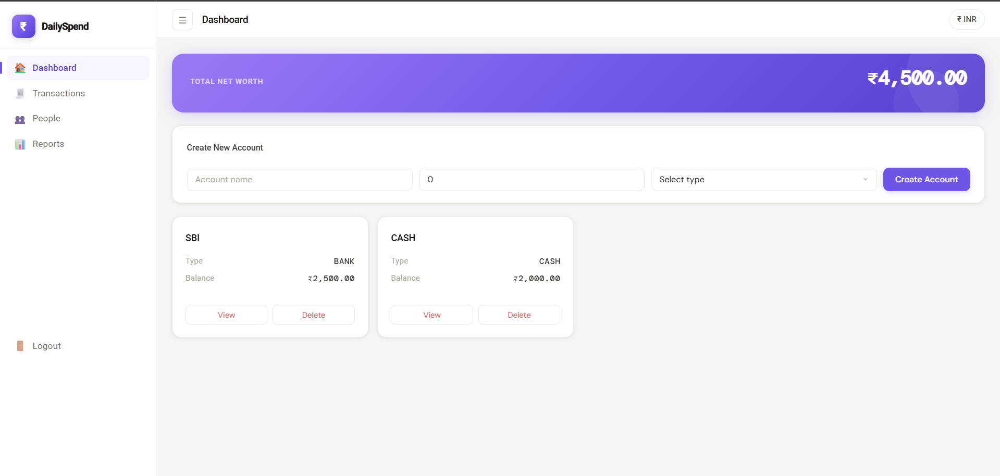
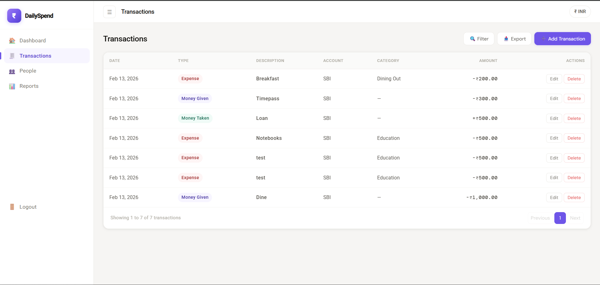
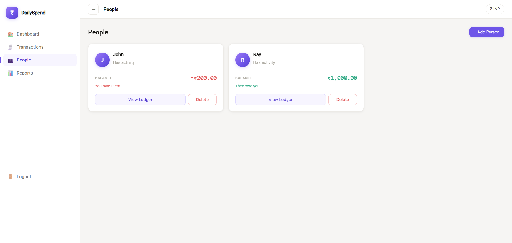
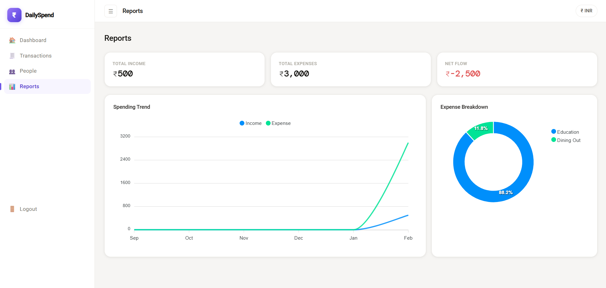
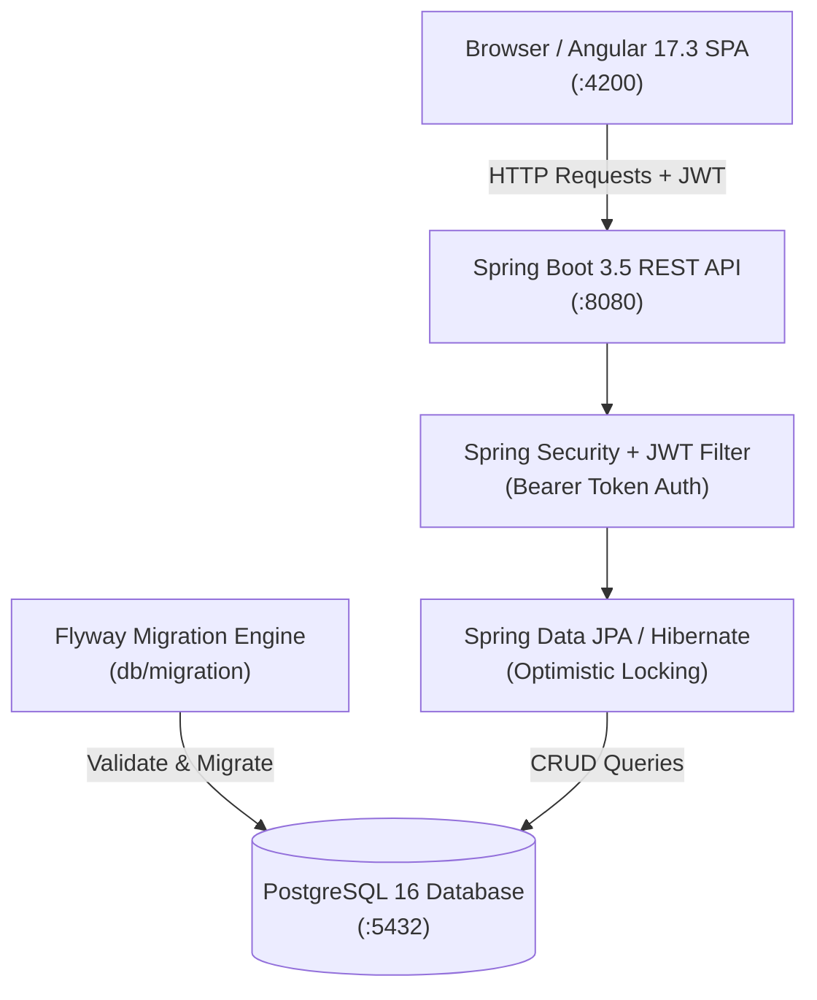

# 💸 DailySpend — Personal Finance Tracker

<p align="center">
  <a href="https://adoptium.net/"></a>
  <a href="https://spring.io/projects/spring-boot"></a>
  <a href="https://angular.dev/"></a>
  <a href="https://www.postgresql.org/"></a>
  <a href="LICENSE"></a>
  <a href="#-installation--setup"></a>
</p>

<p align="center">
  A full-stack web application to track daily expenses, income, and peer lending — built with Spring Boot and Angular.
</p>

---

> [!NOTE]
> **Looking for the Next-Gen Edition?**
> This repository is **DailySpend v1** (Core Lightweight Expense Tracker). For the containerized edition featuring Docker Compose, recurring transactions, and advanced financial analytics, check out **[DailySpend v2 (dailySpend2)](https://github.com/tanmayythakare/dailySpend2)**.

---

## 📸 Visual Showcase

| Dashboard & Accounts | Transactions & Ledger |
| :---: | :---: |
|  |  |
| **People Ledger (Debts & Loans)** | **Reports & Expense Breakdowns** |
|  |  |

---

## 🏛️ System Architecture



---

## 📖 What is DailySpend?

**DailySpend** is a personal finance tracking web application designed to help you take control of your day-to-day money management. Whether you are logging grocery receipts, tracking money lent to friends, or analyzing monthly cash flow, DailySpend keeps it organized in one central place.

### Why does it exist?
Most people struggle with financial leakage and fragmented tracking across disparate apps and notes. DailySpend provides:
1. **Unified Cash Flow**: Clear separation between standard expenses and peer lending.
2. **People Ledger**: Accurate balance tracking with friends and colleagues so you never lose track of who owes whom.
3. **Actionable Insights**: Visual chart breakdowns by category and spending trends over time.

---

## ✨ Features

- 🔐 **User Authentication** — Secure registration and login powered by stateless JWT tokens.
- 🏦 **Multi-Account Management** — Manage distinct financial accounts (Cash, Bank, Credit).
- 💳 **Transaction Tracking** — Record three distinct transaction types:
  - **Expense**: Outgoing spending with category classification.
  - **Money Given**: Peer lending tracked against individual contacts.
  - **Money Taken**: Loans received or money returned.
- 👥 **People Ledger** — Real-time balance calculations per contact (net creditor/debtor status).
- 🗂️ **Smart Categorization** — Built-in and customizable expense categories.
- 📊 **Reports & Analytics** — Interactive spending trends and category breakdown charts via ApexCharts.
- 🔍 **Filter & Search** — Filter transactions by type, account, and custom date range.
- 📥 **CSV Export** — Download complete transaction histories for external analysis.
- 📱 **Responsive UI** — Clean, responsive desktop and mobile interface built with Angular Material.

---

## 🛠️ Tech Stack

### Backend
| Technology | Version | Purpose |
| :--- | :--- | :--- |
| **Java** | 17 LTS | Core programming language |
| **Spring Boot** | 3.5.x | Application framework & dependency injection |
| **Spring Security** | 6.x | Stateless JWT authentication & endpoint authorization |
| **Spring Data JPA** | 3.x | Object-Relational Mapping (Hibernate) with optimistic locking |
| **PostgreSQL** | 16 | Relational database storage |
| **Flyway** | 10.x | Version-controlled database schema migrations |
| **JJWT** | 0.11.5 | JSON Web Token encoding and verification |
| **Maven Wrapper** | 3.x | Reproducible project build automation |

### Frontend
| Technology | Version | Purpose |
| :--- | :--- | :--- |
| **Angular** | 17.3 | Component-based frontend framework |
| **TypeScript** | 5.4 | Type-safe application development |
| **Angular Material** | 17.3 | Accessible UI component library |
| **ApexCharts & ng-apexcharts** | 3.44 | Interactive dashboard charts and analytics visualizations |
| **SCSS** | — | Modular styling and responsive themes |

---

## 📋 Prerequisites

Ensure the following tools are installed on your machine before running locally:

* [Java 17 JDK](https://adoptium.net/) or higher
* [Node.js 18+](https://nodejs.org/) (includes `npm`)
* [PostgreSQL 14+](https://www.postgresql.org/download/)
* [Git](https://git-scm.com/)

---

## 🚀 Installation & Setup

### 1. Clone the Repository
```bash
git clone https://github.com/tanmayythakare/dailySpend.git
cd dailySpend
```

### 2. Set Up the Database
Open PostgreSQL (`psql` or pgAdmin) and create the database:
```sql
CREATE DATABASE dailyspend;
```
> Flyway automatically creates and migrates all required tables when the backend starts.

### 3. Configure the Backend
Navigate to the backend directory:
```bash
cd dailyspend-backend
```

Create your local configuration from the provided template:
```bash
# Copy the sanitized template
cp src/main/resources/application-local.yml.example src/main/resources/application-local.yml
```

Edit `src/main/resources/application-local.yml` with your local PostgreSQL credentials:
```yaml
spring:
  datasource:
    url: jdbc:postgresql://localhost:5432/dailyspend
    username: postgres
    password: your_postgres_password

jwt:
  secret: your_super_secret_key_at_least_32_characters_long
  expiration: 864000000   # 10 days in milliseconds
```

### 4. Run the Backend
Using the included Maven Wrapper:
```bash
# On Windows
./mvnw.cmd spring-boot:run -Dspring-boot.run.profiles=local

# On Linux / macOS
./mvnw spring-boot:run -Dspring-boot.run.profiles=local
```
The backend API starts on **http://localhost:8080**.

### 5. Run the Frontend
Open a new terminal window and navigate to the frontend directory:
```bash
cd dailyspend-frontend
npm install
npm start
```
The Angular application starts on **http://localhost:4200**.

---

## 📁 Repository Structure

```
dailySpend/
├── dailyspend-backend/                  # Spring Boot application
│   ├── src/main/java/com/example/dailyspend/
│   │   ├── config/                      # Security & web configuration
│   │   ├── controller/                  # REST API controllers
│   │   ├── dto/                         # Request & response DTOs
│   │   ├── entity/                      # JPA entities (Account, Transaction, Person)
│   │   ├── exception/                   # Global exception handler
│   │   ├── repository/                  # Spring Data JPA repositories
│   │   ├── service/                     # Business logic services
│   │   └── util/                        # Security & token utilities
│   ├── src/main/resources/
│   │   ├── application.yaml             # Core application properties
│   │   ├── application-local.yml.example# Local environment template
│   │   └── db/migration/                # Flyway SQL migration scripts
│   ├── pom.xml                          # Maven build dependencies
│   └── mvnw.cmd                         # Windows Maven wrapper
├── dailyspend-frontend/                 # Angular 17 SPA
│   ├── src/app/
│   │   ├── core/                        # Authentication guards, interceptors, services
│   │   ├── features/                    # Dashboard, Transactions, People, Reports
│   │   ├── layout/                      # Navbar, sidebar, app shell
│   │   └── shared/                      # Reusable components & pipes
│   ├── package.json                     # Frontend dependencies
│   └── angular.json                     # Angular build configuration
└── docs/
    ├── ARCHITECTURE.md                  # Deep architectural specifications
    ├── RULES.md                         # Engineering conventions
    └── Screenshots/                     # System UI screenshots
```

---

## 🔌 API Reference

The backend exposes a REST API secured by JWT tokens:

| Method | Endpoint | Description | Auth Required |
| :--- | :--- | :--- | :---: |
| `POST` | `/api/auth/register` | Register a new user | No |
| `POST` | `/api/auth/login` | Authenticate and obtain JWT token | No |
| `GET` | `/api/v1/accounts` | List accounts for authenticated user | Yes |
| `POST` | `/api/v1/accounts` | Create an account (Cash, Bank, Credit) | Yes |
| `POST` | `/api/v1/transactions/expense` | Record an outgoing expense | Yes |
| `POST` | `/api/v1/transactions/money-given` | Record money lent to a contact | Yes |
| `POST` | `/api/v1/transactions/money-taken` | Record money borrowed/returned | Yes |
| `GET` | `/api/v1/transactions/filter` | Paginated search with date/type filters | Yes |
| `GET` | `/api/v1/people/with-balances` | Retrieve people ledger with net balances | Yes |
| `GET` | `/api/v1/reports/monthly` | Generate monthly spending & income summary | Yes |

---

## 🔮 Project Evolution & v2 Roadmap

This codebase represents **DailySpend v1**. Active development and next-generation architecture have shifted to **[DailySpend v2 (dailySpend2)](https://github.com/tanmayythakare/dailySpend2)**:

| Feature | DailySpend v1 (This Repo) | DailySpend v2 (dailySpend2) |
| :--- | :---: | :---: |
| **Core Expenses & Peer Ledger** | ✅ Supported | ✅ Supported |
| **Interactive ApexCharts Reports** | ✅ Supported | ✅ Supported |
| **Docker Compose Orchestration** | ❌ Manual Setup | ✅ 1-Command (`docker compose up`) |
| **Recurring Transactions Engine** | ❌ Not in v1 | 🔄 Active Development |
| **Bill Splitter Module** | ❌ Not in v1 | 🔄 Planned |
| **Full Dark Mode Theme** | ❌ Not in v1 | 🔄 Integrated |

---

## 🤝 Contributing

1. Fork the repository.
2. Clone your fork:
   ```bash
   git clone https://github.com/tanmayythakare/dailySpend.git
   ```
3. Create your feature branch:
   ```bash
   git checkout -b feat/your-feature-name
   ```
4. Commit your changes:
   ```bash
   git commit -m "feat: add descriptive feature summary"
   ```
5. Push to your branch and submit a Pull Request.

---

## 📄 License

This project is open-source and distributed under the **[MIT License](LICENSE)**.

---

## 👤 Author

**Tanmay Thakare**
* GitHub: [@tanmayythakare](https://github.com/tanmayythakare)
* Email: [tanmayrthakare@gmail.com](mailto:tanmayrthakare@gmail.com)
* LinkedIn: [Tanmay Thakare](https://www.linkedin.com/in/tanmaythakare)
